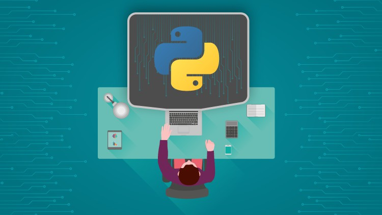

# ¡Bienvenido a mi Repositorio del Python Study Group For Beginners!

***
### El objetivo de este repositorio es:
1. Aprender y practicar conceptos clave de Python.
2. Conocer diversas áreas de aplicación, componentes y sintaxis fundamentales de Python.
3. Resolver desafíos y ejercicios.

