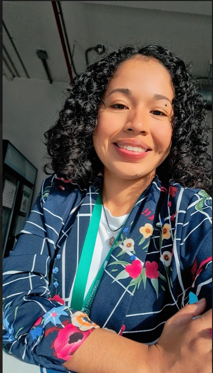

# Biografía Personal 

Hola, soy **Elizabeth Peña Morales** y me gusta:

- Escuchar música, entre mis artistas favoritos están:
    - Carlos Rivera
    - Alex Zurdo
    - Maná
    - Juan Luis Guerra

- También me gustan las **plantas y los animales**, Tengo una gatita que se llama Lila. 
### Mi frase favorita es: ***Lo Único Imposible es Aquello que no Intentas***.

***
## **Cumpleaños y Nacionalidad**
Mi fecha de cumpleaños es el **2 de marzo**, actualmente tengo 25 años y soy **panameña**. 

## **Quien soy**
Me describo como una persona **alegre, amable, paciente, perseverante, ordenada, competitiva, exigente y honesta**. 

Mis amigos me conocen como una persona que le gusta ayudar a los demás, soy la de los consejos XD. 

Me gusta los retos nuevos y algo difíciles. Uno de mis miedos a vencer es hablar en público, soy algo tímida. Pero sin duda considero que *el miedo puede jugar en positivo para quienes los saben usar a su beneficio, a veces el miedo nos dice por dónde debemos continuar y es ese empujón que nos dice "Atrévete a hacerlo!"* 

Me gusta cocinar para mi familia y también sorprenderlos con algo especial en sus cumpleaños.

## **Familia**
Mis padres son una parte importante de mi vida, a los cuales debo su apoyo y amor incondicional en todas las etapas y metas de mi vida.

Tengo una hermana que se parece a mí, las personas nos dicen gemelas XD. A mi hermana le gusta las leyes y los negocios.

Tengo un hermano que le gusta hablar mucho, le gusta la ciencia, los videojuegos y la tecnología. 

## **Carrera y Trayectoria Profesional**
- Estudie **Bachiller en Ciencias** en la secundaria.
  
- Estudie en la Universidad Tecnológica de Panamá, en la Facultad de Sistemas Computacionales, la carrera de **Licenciatura en Ingeniería en Sistemas y Computación** la cual logre culminar estudios en el presente año.
  
Durante mi trayectoria académica en la universidad participe en talleres y conferencias de variados temas en tecnología como:
1. Seguridad Informática
2. Ciencia de Datos
3. Herramientas de Desarrollo de Software

Con mis amigos y compañeros de la universidad participé de:

1. Hackatones
2. Jornadas de Iniciación Científica
3. Asistente Estudiantil de Cursos de Blender y Eon XR. 

## **Intereses o Pasiones**
Mis metas para lograr son
- Convertirme en una analista o ingeniera de datos 
- Ser emprendedora, tener un restaurante de comidas panameñas 
- Aprender a ser una líder 
- Aprender a patinar
- Aprender a tocar piano y guitarra
- Subirme a un globo aerostático
- Viajar a Finlandia para ver las auroras boreales
 
## **Imagen**

Les regalo una foto de esta personita:

